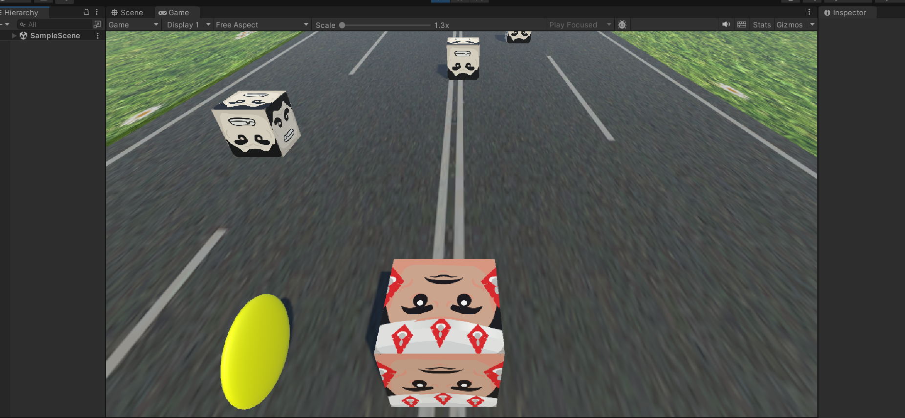

# 🏃‍♂️ Road Runner Game

**Road Runner Game** is a fast-paced arcade-style Unity game where your character sprints along a never-ending track. Dodge incoming enemies and collect coins to boost your score. The game gets more thrilling the longer you survive!

---

## 🎮 Gameplay

- You control a character running on a road.
- Enemies rush toward you — avoid them!
- Coins appear — collect as many as you can!
- One hit from an enemy, and it's game over.

---

### 🕹️ In-Game Action


## 🕹️ Controls

- **←** Move Left  
- **→** Move Right  
- **Spacebar** to Start the Game

---

## 🚀 How to Run the Game

1. Clone the repository:
   ```bash
   git clone https://github.com/siddhant-2310/road-runner-game.git
